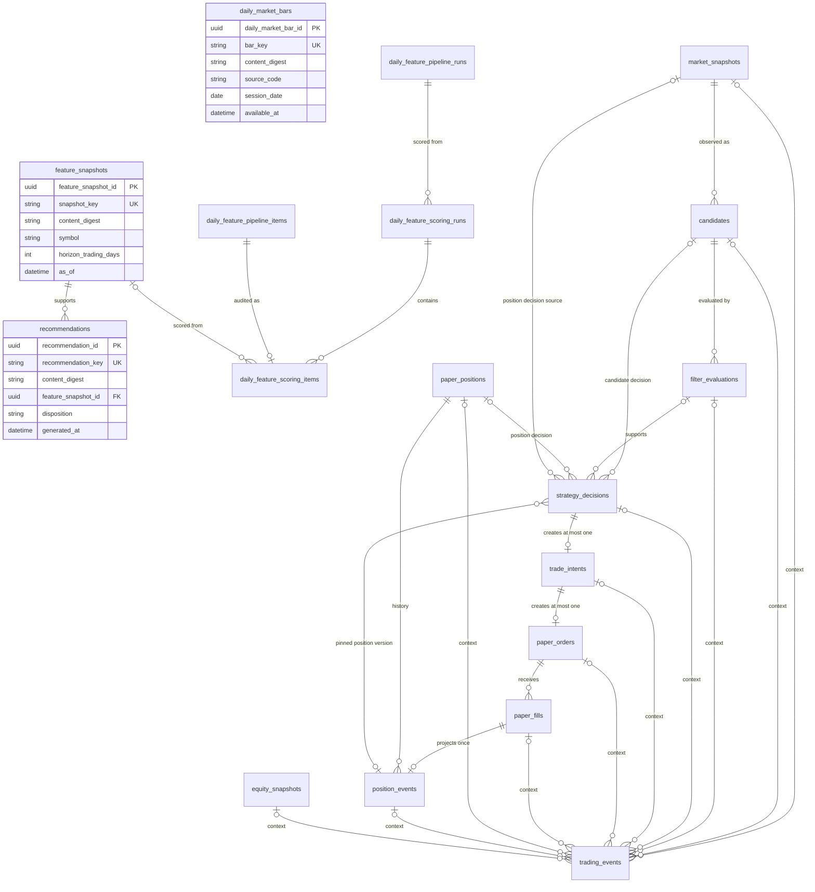

# MSSQL canonical database schema

## 데이터베이스 경계

V2는 운영 인프라를 불필요하게 늘리지 않기 위해 승인된 기존 Microsoft SQL Server
인스턴스를 사용할 수 있습니다. 단, 인스턴스만 공유할 뿐 V1의 database, schema, table,
데이터, 계정 설정 또는 연결 문자열은 읽거나 복사하지 않습니다. V2의 개발 database 이름은
정확히 `auto_trading_v2`이며 모든 business table은 `trading` schema에 생성합니다.
Alembic version table은 기본 `dbo.alembic_version`을 사용합니다.

canonical source of truth는 다음 19개 table입니다.

1. `market_snapshots`
2. `daily_market_bars`
3. `feature_snapshots`
4. `recommendations`
5. `candidates`
6. `filter_evaluations`
7. `paper_positions`
8. `strategy_decisions`
9. `trade_intents`
10. `paper_orders`
11. `paper_fills`
12. `position_events`
13. `equity_snapshots`
14. `trading_events`
15. `universe_snapshots`
16. `daily_feature_pipeline_runs`
17. `daily_feature_pipeline_items`
18. `daily_feature_scoring_runs`
19. `daily_feature_scoring_items`



## 설계와 타입 정책

스키마 정의는 SQLAlchemy Core를 사용합니다. 선언형 ORM 모델의 수명주기나 lazy loading을
도입하지 않고 table contract를 명시적으로 유지하며, 이후 Repository가 필요에 맞게 SQL을
조합할 수 있기 때문입니다. 애플리케이션 import 시 engine 생성이나 연결은 일어나지 않습니다.

MSSQL type mapping은 다음과 같습니다.

| 도메인 값 | MSSQL type | 정책 |
| --- | --- | --- |
| ID | `UNIQUEIDENTIFIER` | Python `UUID`와 직접 왕복 |
| 금액·가격·손익 | `DECIMAL(38,18)` | 최대 정밀도 38, 소수 18자리 |
| 수량 | `BIGINT` | 정수 수량 |
| 시각 | `DATETIMEOFFSET(7)` | UTC offset을 포함한 instant |
| 날짜 | `DATE` | 시각이 없는 거래일 |
| bool | `BIT` | 참/거짓 |
| 통화 | `CHAR(3)` + BIN2 | 대문자 영문 3자리 |
| 종목 코드 | `VARCHAR(32)` + BIN2 | `[A-Z0-9][A-Z0-9.-]{0,31}` |
| 코드·semantic key | `VARCHAR(n)` + BIN2 | 대소문자와 byte 의미 보존 |
| JSON | `NVARCHAR(MAX)` | Unicode JSON text |

`DECIMAL(38,18)`은 정수부 20자리와 소수부 18자리를 정확하게 보존합니다. `MONEY`와
`SMALLMONEY`는 고정된 작은 소수 자릿수와 범위 때문에, `FLOAT`와 `REAL`은 이진 부동소수점
오차 때문에 공식 금액·가격 column에 사용하지 않습니다. 통화별 표시 및 양자화 규칙은 이후
application policy에서 결정합니다.

모든 domain timestamp는 `DATETIMEOFFSET(7)`이며 UTC aware 값으로 기록합니다. DB 기본
시각은 `TODATETIMEOFFSET(SYSUTCDATETIME(), '+00:00')`입니다. 입력 offset이 다르더라도
동일한 UTC instant를 나타내야 하며 naive timestamp는 허용하지 않습니다.

ID는 MSSQL `UNIQUEIDENTIFIER`와 domain의 타입별 UUID 값 객체를 대응시킵니다. 현재 기본
생성기는 UUID4이며 UUIDv7은 비목표입니다.

JSON column은 `NVARCHAR(MAX)`에 저장하고 `ISJSON(column) = 1`을 강제합니다. `details`와
`payload`, `feature_values`는 JSON object, `reason_codes`, `quality_reason_codes`,
`provenance`는 JSON array 형태까지 check constraint로 제한합니다.
JSON은 검색 최적화된 정규화 데이터의 대체물이 아니라 확장 가능한 설명·감사 payload입니다.

## P3 universe and daily feature pipeline

`trading.universe_snapshots` stores one immutable caller-provided membership definition. Its
semantic identity is `(universe_code, universe_version)`. The `universe_key` hashes that identity;
`content_digest` hashes only the MIC/symbol member list in canonical order. The JSON member array is
non-empty, contains 1 to 100 members, and is mapped without provider URLs or raw payloads.

`trading.daily_feature_pipeline_runs` references one UniverseSnapshot with `ON DELETE NO ACTION`.
Its unique run key includes the pipeline/version, universe ID, provider, calendar/version,
completed-session marker, split adjustment, feature set/version, horizon, requested sessions,
normalized `as_of`, and completion grace. Outcome counts are non-negative and must sum to the total.

`trading.daily_feature_pipeline_items` is inserted with its run in one transaction and retains
canonical ordinal order. READY and DEGRADED items require a FeatureSnapshot FK and matching quality;
all other outcomes require both feature fields to be null. Unique constraints cover run/ordinal,
run/symbol, and run/symbol/MIC. Migration `0007_multi_symbol_feature_pipeline` creates only these
three tables and downgrades them in item, run, universe order. Existing migrations 0001 through 0006
and their fourteen tables are unchanged.

## P4A daily feature scoring

`trading.daily_feature_scoring_runs` identifies one immutable scoring result by the source P3 run
and four fixed scoring/ranking policy fields. Its key is a versioned SHA-256 identity; the content
digest covers status, counts, ordered item outcomes, fixed Decimal scores, and ranks. It is not
unique so identical content from different source runs remains auditable.

`trading.daily_feature_scoring_items` preserves the P3 ordinal and stores nullable `DECIMAL(9,6)`
component/overall relative scores. READY rows contain all six components; supported volume-related
DEGRADED rows contain price components and a null volume component. Unscorable rows contain no
scores or rank and require a safe reason code. FKs to the scoring run, P3 item, and optional
FeatureSnapshot all use `ON DELETE NO ACTION`. Migration `0008_daily_feature_scoring` adds only
these two tables, taking the canonical count from 17 to 19, and downgrades only to
`0007_multi_symbol_feature_pipeline`.

## Point-in-Time FeatureSnapshot

`trading.feature_snapshots`는 기존 11개 table과 FK가 없는 독립 aggregate입니다. 최소 column은
ID, semantic `snapshot_key`, 독립 `content_digest`, symbol, feature set code/version, 1~5
trading-day horizon, `as_of`, `generated_at`, 계산된 `latest_input_available_at`, READY/DEGRADED
quality, reason JSON, feature JSON, provenance JSON과 DB 생성 `recorded_at`입니다.

DB는 horizon 범위, `generated_at >= as_of`, `latest_input_available_at <= as_of`, quality 상태,
비어 있지 않은 feature/provenance JSON 형태를 검사합니다. `snapshot_key`와
`(symbol, feature_set_code, feature_set_version, horizon_trading_days, as_of)`는 각각
unique입니다. `content_digest`는 비교·감사용 non-unique index입니다. 조회 index는 symbol/cutoff,
feature set/cutoff, quality/cutoff 조합을 제공합니다.

## Canonical Recommendation

`trading.recommendations`는 하나의 `feature_snapshot_id`를 `ON DELETE NO ACTION` FK로 참조하는
immutable 사용자 판단 fact입니다. `RECOMMEND`와 `CONDITIONAL`만 actionable이며 USD 가격
계획·1~5 거래일 보유 기간·Decimal 확률/기대값/손익비/신뢰도·UTC 만료 시각을 모두 가집니다.
`WATCH`, `NO_RECOMMENDATION`, `DATA_INSUFFICIENT`, `MARKET_RISK`는 모든 plan column을 `NULL`로
저장합니다.

`recommendation_key`는 FeatureSnapshot ID와 generator code/version만 포함한 semantic identity
hash이고, `content_digest`는 disposition·plan·정렬된 reason/risk/invalidation code만 포함합니다.
두 key의 분리로 exact retry와 same-identity/different-content conflict를 구분합니다. key 및
`(feature_snapshot_id, generator_code, generator_version)`는 unique이고 content digest는
non-unique입니다. 이 table은 StrategyDecision·TradeIntent·주문·체결·포지션 FK를 갖지 않습니다.

## 정합성과 중복 방지

모든 FK는 `ON DELETE NO ACTION`입니다. 체결·이벤트 같은 감사 사실이 부모 삭제로 연쇄
손실되지 않도록 하며 삭제보다 명시적 상태 전이를 사용합니다. PK는 각 table의 타입별 UUID
ID이고 FK, unique, check와 조회 index는 모두 이름을 가집니다.

MSSQL filtered unique index는 다음 네 개입니다.

- `ix_paper_positions_open_unique`: strategy, symbol, currency별 `OPEN` position 하나
- `ix_strategy_decisions_candidate_unique`: candidate, strategy, version별 candidate decision 하나
- `ix_strategy_decisions_position_snapshot_unique`: position, snapshot, strategy, version별
  position decision 하나
- `ix_paper_orders_broker_ref_unique`: broker order reference가 있을 때 broker 내 하나

주요 semantic deduplication key는 다음과 같습니다.

- snapshot: `(source, symbol, observed_at)`
- feature snapshot: `snapshot_key`, 그리고
  `(symbol, feature_set_code, feature_set_version, horizon_trading_days, as_of)`
- recommendation: `recommendation_key`, 그리고
  `(feature_snapshot_id, generator_code, generator_version)`
- candidate: `(run_id, market_snapshot_id, candidate_source)`
- filter evaluation: `(candidate_id, filter_set_id, evaluation_version)`
- strategy decision: `decision_key`, filtered candidate/strategy/version, 그리고 filtered
  position/snapshot/strategy/version
- trade intent: `decision_id`, `idempotency_key`
- paper order: `trade_intent_id`, `client_order_id`, 그리고 filtered broker reference
- fill: `execution_key`, `(order_id, fill_sequence)`
- position event: `fill_id`, `(position_id, sequence_no)`
- equity snapshot: `snapshot_key`, `(strategy_id, currency, as_of)`
- trading event: `dedup_key`

Candidate decision은 Candidate의 `market_snapshot_id`를 통해 canonical snapshot에 연결되며
`strategy_decisions.market_snapshot_id`와 `position_version`을 중복 저장하지 않습니다.
Position decision은 `position_id`, `position_version`, `market_snapshot_id`를 직접 저장합니다.
`(position_id, position_version)`은
`position_events(position_id, sequence_no)`를 참조하여 mutable PaperPosition의 exact canonical
version을 고정합니다. 관련 FK는 모두 `ON DELETE NO ACTION`입니다. `trading_events`의 선택적
context FK는 통합 타임라인을 위한 것이며 이 source 관계의 원본이 아닙니다.

`market_snapshots`, `feature_snapshots`, `recommendations`, `candidates`, `filter_evaluations`,
`strategy_decisions`, `trade_intents`, `paper_fills`, `position_events`, `equity_snapshots`,
`trading_events`는 기록 후 의미를 바꾸지 않는 immutable fact입니다. `paper_positions`와
`paper_orders`는 optimistic `version`과 `updated_at`을 가진 current-state table입니다.

## 생성과 마이그레이션

실제 URL은 출력·commit하지 말고 placeholder를 각 실행 환경에서만 치환합니다. Microsoft
ODBC Driver 18이 설치되어 있으면 우선 사용하며, 승인된 다른 Microsoft SQL Server ODBC
driver도 명시적으로 사용할 수 있습니다. FreeTDS와 다른 DB dialect는 거부합니다.

PowerShell:

```powershell
$env:AUTO_TRADING_V2_MSSQL_ADMIN_URL = "<redacted-admin-sqlalchemy-url>"
$env:AUTO_TRADING_V2_DATABASE_URL = "<redacted-v2-database-url>"
$env:AUTO_TRADING_V2_TEST_ADMIN_URL = "<redacted-test-admin-url>"

python scripts/create_database.py
alembic upgrade head
alembic current
alembic check
python scripts/inspect_database.py
```

Bash:

```bash
export AUTO_TRADING_V2_MSSQL_ADMIN_URL="<redacted-admin-sqlalchemy-url>"
export AUTO_TRADING_V2_DATABASE_URL="<redacted-v2-database-url>"
export AUTO_TRADING_V2_TEST_ADMIN_URL="<redacted-test-admin-url>"

python scripts/create_database.py
alembic upgrade head
alembic current
alembic check
python scripts/inspect_database.py
```

생성 도구는 admin URL이 `master`를 대상으로 하는지 확인하고 정확히
`auto_trading_v2`만 생성합니다. 이미 있으면 알려진 `trading` table과 Alembic revision만
검사하며 부분 schema 또는 알 수 없는 user table이 있으면 중단합니다. database 생성과 table
생성을 분리하며 table은 Alembic만 담당합니다. development DB를 drop하는 API는 없습니다.

## 임시 DB 테스트와 운영 안전

통합 테스트 database 이름은 `auto_trading_v2_test_` 접두사 뒤에 무작위 suffix를 붙입니다.
fixture는 실행 중 자신이 생성한 정확한 이름만 삭제하며, 삭제 직전 접두사를 다시 검사합니다.
`AUTO_TRADING_V2_TEST_ADMIN_URL`이 없을 때만 명시적으로 admin URL을 재사용할 수 있습니다.
연결 정보가 없으면 통합 테스트는 실패 대신 skip됩니다.

`alembic downgrade base`와 재-upgrade 검증은 이 임시 test DB에서만 수행합니다. 개발 또는
운영 DB에서 downgrade하지 않습니다. 전체 downgrade는 먼저 `daily_market_bars`, 이어
`recommendations`와 독립 `feature_snapshots`를 제거한 뒤 reverse dependency 순서로 기존
11개 table과 비어 있는 `trading` schema만 제거하며 database 자체는 절대 삭제하지 않습니다.

connection URL, server host, login, password는 log, exception, test output, 문서와 최종
보고에서 출력하지 않습니다. URL wrapper는 문자열 변환과 `repr`에서도 값을 redaction합니다.
production backup, 복구, 운영 배포와 data file 관리는 이 PR의 비목표입니다.

초기 `0001_mssql_schema`는 수정하지 않습니다. `0002_position_snapshot`은
`strategy_decisions.market_snapshot_id`, FK, source-shape CHECK, position semantic filtered
unique index와 최소 조회 index를 additive migration으로 적용합니다. 기존 candidate row는
신규 column이 `NULL`인 채 그대로 유효합니다.

`0003_position_decision_version`은 `strategy_decisions.position_version`, positive/source-shape
CHECK, `(position_id, position_version)` composite FK와 조회 index를 additive migration으로
적용합니다. 기존 candidate row는 `NULL`로 보존됩니다. 기존 position decision이 있으면
임의 backfill하지 않고 sanitized blocker로 upgrade를 중단합니다.

`0004_feature_snapshots`는 기존 table이나 data를 변경하지 않고
`trading.feature_snapshots` 하나만 생성합니다. downgrade도 이 table 하나만 제거합니다.
기존 `0001`~`0003` 파일과 기존 11개 table definition은 변경하지 않습니다.

`0005_recommendations`는 기존 12개 table이나 data를 변경하지 않고
`trading.recommendations` 하나만 생성합니다. downgrade도 이 table 하나만 제거합니다.
기존 `0001`~`0004` 파일과 기존 12개 table definition은 변경하지 않습니다.

`0006_daily_market_bars`는 기존 13개 table이나 data를 변경하지 않고 독립
`trading.daily_market_bars` 하나만 생성합니다. downgrade도 이 table 하나만 제거합니다.
bar에는 FK가 없으며 provider identity, session revision uniqueness, PIT 조회 index를
제공합니다. 기존 `0001`~`0005` 파일과 기존 13개 table definition은 변경하지 않습니다.

아래 기존 Application 설명은 optional shadow simulation 기반의 역사적 범위입니다.
Application은 OPEN 상태, exact PositionEvent version, symbol, strategy, USD 통화, snapshot
평가 시각과 freshness를 검증하고 `FIXED_POSITION_EXIT/v1` 결정을 저장합니다. SELL, position
종료와 P&L은 여전히 이 schema migration과 PR 12의 범위가 아닙니다.
