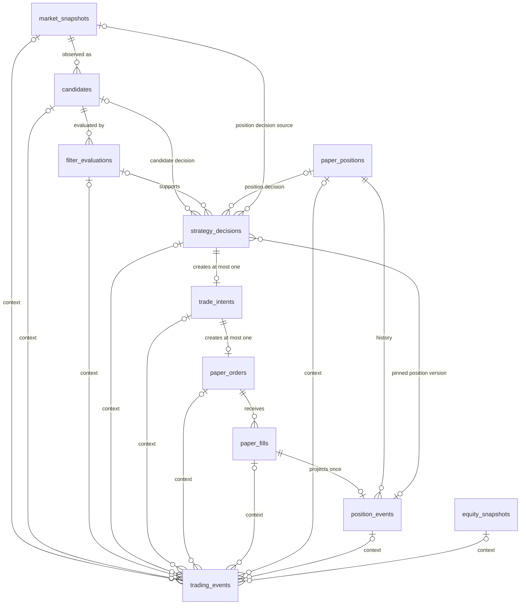

# MSSQL canonical database schema

## 데이터베이스 경계

V2는 운영 인프라를 불필요하게 늘리지 않기 위해 승인된 기존 Microsoft SQL Server
인스턴스를 사용할 수 있습니다. 단, 인스턴스만 공유할 뿐 V1의 database, schema, table,
데이터, 계정 설정 또는 연결 문자열은 읽거나 복사하지 않습니다. V2의 개발 database 이름은
정확히 `auto_trading_v2`이며 모든 business table은 `trading` schema에 생성합니다.
Alembic version table은 기본 `dbo.alembic_version`을 사용합니다.

canonical source of truth는 다음 11개 table입니다.

1. `market_snapshots`
2. `candidates`
3. `filter_evaluations`
4. `paper_positions`
5. `strategy_decisions`
6. `trade_intents`
7. `paper_orders`
8. `paper_fills`
9. `position_events`
10. `equity_snapshots`
11. `trading_events`



## 설계와 타입 정책

스키마 정의는 SQLAlchemy Core를 사용합니다. 선언형 ORM 모델의 수명주기나 lazy loading을
도입하지 않고 table contract를 명시적으로 유지하며, 이후 Repository가 필요에 맞게 SQL을
조합할 수 있기 때문입니다. 애플리케이션 import 시 engine 생성이나 연결은 일어나지 않습니다.

MSSQL type mapping은 다음과 같습니다.

| 도메인 값 | MSSQL type | 정책 |
| --- | --- | --- |
| ID | `UNIQUEIDENTIFIER` | Python `UUID`와 직접 왕복 |
| 금액·가격·손익 | `DECIMAL(38,18)` | 최대 정밀도 38, 소수 18자리 |
| 수량 | `BIGINT` | 정수 수량 |
| 시각 | `DATETIMEOFFSET(7)` | UTC offset을 포함한 instant |
| 날짜 | `DATE` | 시각이 없는 거래일 |
| bool | `BIT` | 참/거짓 |
| 통화 | `CHAR(3)` + BIN2 | 대문자 영문 3자리 |
| 종목 코드 | `VARCHAR(32)` + BIN2 | `[A-Z0-9][A-Z0-9.-]{0,31}` |
| 코드·semantic key | `VARCHAR(n)` + BIN2 | 대소문자와 byte 의미 보존 |
| JSON | `NVARCHAR(MAX)` | Unicode JSON text |

`DECIMAL(38,18)`은 정수부 20자리와 소수부 18자리를 정확하게 보존합니다. `MONEY`와
`SMALLMONEY`는 고정된 작은 소수 자릿수와 범위 때문에, `FLOAT`와 `REAL`은 이진 부동소수점
오차 때문에 공식 금액·가격 column에 사용하지 않습니다. 통화별 표시 및 양자화 규칙은 이후
application policy에서 결정합니다.

모든 domain timestamp는 `DATETIMEOFFSET(7)`이며 UTC aware 값으로 기록합니다. DB 기본
시각은 `TODATETIMEOFFSET(SYSUTCDATETIME(), '+00:00')`입니다. 입력 offset이 다르더라도
동일한 UTC instant를 나타내야 하며 naive timestamp는 허용하지 않습니다.

ID는 MSSQL `UNIQUEIDENTIFIER`와 domain의 타입별 UUID 값 객체를 대응시킵니다. 현재 기본
생성기는 UUID4이며 UUIDv7은 비목표입니다.

JSON column은 `NVARCHAR(MAX)`에 저장하고 `ISJSON(column) = 1`을 강제합니다. `details`와
`payload`는 JSON object, `reason_codes`는 JSON array 형태까지 check constraint로 제한합니다.
JSON은 검색 최적화된 정규화 데이터의 대체물이 아니라 확장 가능한 설명·감사 payload입니다.

## 정합성과 중복 방지

모든 FK는 `ON DELETE NO ACTION`입니다. 체결·이벤트 같은 감사 사실이 부모 삭제로 연쇄
손실되지 않도록 하며 삭제보다 명시적 상태 전이를 사용합니다. PK는 각 table의 타입별 UUID
ID이고 FK, unique, check와 조회 index는 모두 이름을 가집니다.

MSSQL filtered unique index는 다음 네 개입니다.

- `ix_paper_positions_open_unique`: strategy, symbol, currency별 `OPEN` position 하나
- `ix_strategy_decisions_candidate_unique`: candidate, strategy, version별 candidate decision 하나
- `ix_strategy_decisions_position_snapshot_unique`: position, snapshot, strategy, version별
  position decision 하나
- `ix_paper_orders_broker_ref_unique`: broker order reference가 있을 때 broker 내 하나

주요 semantic deduplication key는 다음과 같습니다.

- snapshot: `(source, symbol, observed_at)`
- candidate: `(run_id, market_snapshot_id, candidate_source)`
- filter evaluation: `(candidate_id, filter_set_id, evaluation_version)`
- strategy decision: `decision_key`, filtered candidate/strategy/version, 그리고 filtered
  position/snapshot/strategy/version
- trade intent: `decision_id`, `idempotency_key`
- paper order: `trade_intent_id`, `client_order_id`, 그리고 filtered broker reference
- fill: `execution_key`, `(order_id, fill_sequence)`
- position event: `fill_id`, `(position_id, sequence_no)`
- equity snapshot: `snapshot_key`, `(strategy_id, currency, as_of)`
- trading event: `dedup_key`

Candidate decision은 Candidate의 `market_snapshot_id`를 통해 canonical snapshot에 연결되며
`strategy_decisions.market_snapshot_id`와 `position_version`을 중복 저장하지 않습니다.
Position decision은 `position_id`, `position_version`, `market_snapshot_id`를 직접 저장합니다.
`(position_id, position_version)`은
`position_events(position_id, sequence_no)`를 참조하여 mutable PaperPosition의 exact canonical
version을 고정합니다. 관련 FK는 모두 `ON DELETE NO ACTION`입니다. `trading_events`의 선택적
context FK는 통합 타임라인을 위한 것이며 이 source 관계의 원본이 아닙니다.

`market_snapshots`, `candidates`, `filter_evaluations`, `strategy_decisions`, `trade_intents`,
`paper_fills`, `position_events`, `equity_snapshots`, `trading_events`는 기록 후 의미를 바꾸지 않는
immutable fact입니다. `paper_positions`와 `paper_orders`는 optimistic `version`과 `updated_at`을
가진 current-state table입니다. 이 PR은 해당 갱신이나 projection 업무 로직을 구현하지
않습니다.

## 생성과 마이그레이션

실제 URL은 출력·commit하지 말고 placeholder를 각 실행 환경에서만 치환합니다. Microsoft
ODBC Driver 18이 설치되어 있으면 우선 사용하며, 승인된 다른 Microsoft SQL Server ODBC
driver도 명시적으로 사용할 수 있습니다. FreeTDS와 다른 DB dialect는 거부합니다.

PowerShell:

```powershell
$env:AUTO_TRADING_V2_MSSQL_ADMIN_URL = "<redacted-admin-sqlalchemy-url>"
$env:AUTO_TRADING_V2_DATABASE_URL = "<redacted-v2-database-url>"
$env:AUTO_TRADING_V2_TEST_ADMIN_URL = "<redacted-test-admin-url>"

python scripts/create_database.py
alembic upgrade head
alembic current
alembic check
python scripts/inspect_database.py
```

Bash:

```bash
export AUTO_TRADING_V2_MSSQL_ADMIN_URL="<redacted-admin-sqlalchemy-url>"
export AUTO_TRADING_V2_DATABASE_URL="<redacted-v2-database-url>"
export AUTO_TRADING_V2_TEST_ADMIN_URL="<redacted-test-admin-url>"

python scripts/create_database.py
alembic upgrade head
alembic current
alembic check
python scripts/inspect_database.py
```

생성 도구는 admin URL이 `master`를 대상으로 하는지 확인하고 정확히
`auto_trading_v2`만 생성합니다. 이미 있으면 알려진 `trading` table과 Alembic revision만
검사하며 부분 schema 또는 알 수 없는 user table이 있으면 중단합니다. database 생성과 table
생성을 분리하며 table은 Alembic만 담당합니다. development DB를 drop하는 API는 없습니다.

## 임시 DB 테스트와 운영 안전

통합 테스트 database 이름은 `auto_trading_v2_test_` 접두사 뒤에 무작위 suffix를 붙입니다.
fixture는 실행 중 자신이 생성한 정확한 이름만 삭제하며, 삭제 직전 접두사를 다시 검사합니다.
`AUTO_TRADING_V2_TEST_ADMIN_URL`이 없을 때만 명시적으로 admin URL을 재사용할 수 있습니다.
연결 정보가 없으면 통합 테스트는 실패 대신 skip됩니다.

`alembic downgrade base`와 재-upgrade 검증은 이 임시 test DB에서만 수행합니다. 개발 또는
운영 DB에서 downgrade하지 않습니다. downgrade는 reverse dependency 순서로 11개 table과
비어 있는 `trading` schema만 제거하며 database 자체는 절대 삭제하지 않습니다.

connection URL, server host, login, password는 log, exception, test output, 문서와 최종
보고에서 출력하지 않습니다. URL wrapper는 문자열 변환과 `repr`에서도 값을 redaction합니다.
production backup, 복구, 운영 배포와 data file 관리는 이 PR의 비목표입니다.

초기 `0001_mssql_schema`는 수정하지 않습니다. `0002_position_snapshot`은
`strategy_decisions.market_snapshot_id`, FK, source-shape CHECK, position semantic filtered
unique index와 최소 조회 index를 additive migration으로 적용합니다. 기존 candidate row는
신규 column이 `NULL`인 채 그대로 유효합니다.

`0003_position_decision_version`은 `strategy_decisions.position_version`, positive/source-shape
CHECK, `(position_id, position_version)` composite FK와 조회 index를 additive migration으로
적용합니다. 기존 candidate row는 `NULL`로 보존됩니다. 기존 position decision이 있으면
임의 backfill하지 않고 sanitized blocker로 upgrade를 중단합니다.

Application은 OPEN 상태, exact PositionEvent version, symbol, strategy, USD 통화, snapshot
평가 시각과 freshness를 검증하고 `FIXED_POSITION_EXIT/v1` 결정을 저장합니다. SELL, position
종료와 P&L은 여전히 이 schema migration과 PR 12의 범위가 아닙니다.
